# myapp – Terraform Infrastructure

Production-grade AWS infrastructure managed by Terraform. Supports `dev` and `prod` environments with full module reuse.

---

## Architecture Overview

### Dev Environment
```
Internet
   │
   ▼
[ Route53 ] ── api.dev.example.com / admin.dev.example.com / app.dev.example.com
   │                (A records → EC2 public IPs)
   ▼
[ EC2 (t3a.medium) – Public IP ]
   ├── nginx (reverse proxy, listens on :80)
   │     ├── proxy_pass → be container     (127.0.0.1:8080)
   │     ├── proxy_pass → fe-admin         (127.0.0.1:3000)
   │     └── proxy_pass → fe-customer      (127.0.0.1:3000)
   └── ECS Agent → containers (bridge network, hostPort=0)
         │
         ├──► [ RDS PostgreSQL (db.t4g.micro) ]  ← ECS SG only
         ├──► [ ElastiCache Redis (cache.t4g.micro) ] ← ECS SG only
         └──► [ S3 Bucket (files) ]

[ Secrets Manager ] ── DB_PASSWORD, REDIS_AUTH_TOKEN → injected into containers
[ CloudWatch Logs ] ── /aws/ecs/{project}/dev/{service}
```

### Prod Environment

```mermaid
flowchart TD
    %% ── External ──────────────────────────────────────────────────────────
    Internet(["🌐 Internet"])
    CF(["☁️ Cloudflare\n(optional CDN / WAF)"])

    %% ── DNS ───────────────────────────────────────────────────────────────
    subgraph DNS["Route 53  (Hosted Zone: example.com)"]
        R53_API["api.example.com\n→ ALB alias"]
        R53_ADM["admin.example.com\n→ ALB alias"]
        R53_APP["app.example.com\n→ ALB alias"]
    end

    %% ── Public Subnet ─────────────────────────────────────────────────────
    subgraph PUB["Public Subnets  (ap-southeast-1a / 1b)"]
        subgraph ALB_BOX["ALB  (aws-sg-labhub-prod-alb-001)\nSG: 80/443 from 0.0.0.0/0"]
            ALB["Application Load Balancer\nHTTPS :443  →  HTTP :80 redirect"]
            TG_BE["Target Group\n/api/*  pri=10\nhealth: /api/v1/health"]
            TG_ADM["Target Group\n/admin/*  pri=20\nhealth: /"]
            TG_APP["Target Group\n/*  pri=30\nhealth: /"]
        end
    end

    %% ── Private Subnet ────────────────────────────────────────────────────
    subgraph PRIV["Private Subnets  (ap-southeast-1a / 1b)"]
        subgraph ECS_BOX["ECS Cluster  (EC2 On-Demand, t3a.medium)\nASG min=1 max=3  |  SG: all TCP from ALB SG"]
            EC2["EC2 Node\nECS Agent + SSM Agent\n(no public IP, SSM access only)"]
            SVC_BE["ECS Service: labhub-be-prod\ncontainerPort 8080  cpu=512  mem=1024\ndesiredCount=2"]
            SVC_ADM["ECS Service: labhub-fe-admin-prod\ncontainerPort 3000  cpu=256  mem=512\ndesiredCount=2"]
            SVC_APP["ECS Service: labhub-fe-customer-prod\ncontainerPort 3000  cpu=256  mem=512\ndesiredCount=2"]
        end

        subgraph DATA["Data Layer"]
            RDS[("RDS PostgreSQL\ndb.t4g.small\nMulti-AZ\nSG: 5432 from ECS SG only")]
            REDIS[("ElastiCache Redis\ncache.t4g.small\nSG: 6379 from ECS SG only")]
        end
    end

    %% ── AWS Managed Services ──────────────────────────────────────────────
    subgraph MANAGED["AWS Managed Services"]
        SM["Secrets Manager\nlabhub-prod/app-secrets\nDB_PASSWORD · REDIS_AUTH_TOKEN"]
        S3["S3 Buckets\naws-sg-labhub-prod-s3-bucket-001  public\naws-sg-labhub-prod-s3-bucket-002  private\nversioning + lifecycle"]
        CW["CloudWatch Logs\n/aws/ecs/labhub/prod/be\n/aws/ecs/labhub/prod/fe-admin\n/aws/ecs/labhub/prod/fe-customer\nretention: 90 days"]
        ECR["ECR Repositories\nlabhub-be-prod\nlabhub-fe-admin-prod\nlabhub-fe-customer-prod"]
        SSM_SVC["AWS Systems Manager\nSession Manager\n(SSH-free EC2 access)"]
    end

    %% ── IAM ───────────────────────────────────────────────────────────────
    subgraph IAM["IAM"]
        EXEC_ROLE["Task Execution Role\nECR pull · CW Logs · SM GetSecretValue"]
        TASK_ROLE["Task Role\nS3 read/write · SM runtime · CW Logs SDK"]
        INST_ROLE["EC2 Instance Role\nECS agent · SSM managed instance"]
    end

    %% ── Flows ─────────────────────────────────────────────────────────────
    Internet --> CF
    CF --> DNS
    Internet --> DNS

    DNS --> ALB
    ALB --> TG_BE
    ALB --> TG_ADM
    ALB --> TG_APP

    TG_BE  -->|"port 8080"| SVC_BE
    TG_ADM -->|"port 3000"| SVC_ADM
    TG_APP -->|"port 3000"| SVC_APP

    EC2 --- SVC_BE
    EC2 --- SVC_ADM
    EC2 --- SVC_APP

    SVC_BE  -->|"5432 TCP"| RDS
    SVC_ADM -->|"5432 TCP"| RDS
    SVC_APP -->|"5432 TCP"| RDS

    SVC_BE  -->|"6379 TCP"| REDIS
    SVC_ADM -->|"6379 TCP"| REDIS
    SVC_APP -->|"6379 TCP"| REDIS

    SVC_BE  -->|"HTTPS 443"| S3
    SVC_ADM -->|"HTTPS 443"| S3
    SVC_APP -->|"HTTPS 443"| S3

    SVC_BE  -->|"logs"| CW
    SVC_ADM -->|"logs"| CW
    SVC_APP -->|"logs"| CW

    EXEC_ROLE -->|"inject secrets at startup"| SVC_BE
    EXEC_ROLE -->|"inject secrets at startup"| SVC_ADM
    EXEC_ROLE -->|"inject secrets at startup"| SVC_APP

    EXEC_ROLE -->|"pull image"| ECR
    SM        -->|"DB_PASSWORD · REDIS_AUTH_TOKEN"| EXEC_ROLE

    TASK_ROLE -->|"runtime S3 / SM / CW"| SVC_BE
    INST_ROLE -->|"ECS agent reg · SSM"| EC2
    SSM_SVC   -->|"shell (no SSH)"| EC2

    %% ── Styles ────────────────────────────────────────────────────────────
    classDef aws fill:#FF9900,color:#000,stroke:#c47200,font-weight:bold
    classDef data fill:#3F8624,color:#fff,stroke:#2d6318
    classDef managed fill:#232F3E,color:#fff,stroke:#131921
    classDef iam fill:#DD344C,color:#fff,stroke:#a3243b
    classDef net fill:#8C4FFF,color:#fff,stroke:#6a3bbf
    classDef ext fill:#1A9C3E,color:#fff,stroke:#137a2f

    class ALB,TG_BE,TG_ADM,TG_APP aws
    class EC2,SVC_BE,SVC_ADM,SVC_APP aws
    class RDS,REDIS data
    class SM,S3,CW,ECR,SSM_SVC managed
    class EXEC_ROLE,TASK_ROLE,INST_ROLE iam
    class R53_API,R53_ADM,R53_APP net
    class Internet,CF ext
```



> **Rendered diagram:** GitHub, GitLab and most Markdown previewers render Mermaid natively. In JetBrains IDE install the **Mermaid** plugin to preview inline.

> **🖼️ Visual AWS icon diagram:** Open [`architecture-prod.html`](./architecture-prod.html) in any browser to see a fully rendered interactive diagram with AWS-style icons for both **prod** and **dev** environments. No plugins required.

### Security group rules

| SG | Environment | Inbound | Outbound |
|----|-------------|---------|----------|
| `nginx` | dev | 80/443 from `0.0.0.0/0`, 22 from `ssh_allowed_cidrs` | All |
| `ecs` | dev | All TCP from `vpc_cidr` (nginx on same host) | All |
| `alb` | prod | 80/443 from `0.0.0.0/0` | All |
| `ecs` | prod | All TCP from `alb` SG | All |
| `redis` | both | 6379 from `ecs` SG only | All |
| `postgres` | both | 5432 from `ecs` SG only | All |

---

## Prerequisites

| Requirement | Details |
|-------------|---------|
| Terraform | >= 1.10.0 |
| AWS CLI | Configured with appropriate credentials |
| IAM permissions | EC2, ECS, RDS, ElastiCache, S3, Route53, CloudWatch, IAM, ALB, Secrets Manager, EventBridge Scheduler |
| Route53 Hosted Zone | Must exist before applying (e.g. `example.com`) |
| ACM Certificate | Required for prod only – wildcard or per-domain cert in `ap-southeast-1` |
| VPC & Subnets | Existing VPC with public + private subnets across 2 AZs |
| ECS-optimized AMI | `aws ssm get-parameter --name /aws/service/ecs/optimized-ami/amazon-linux-2/recommended/image_id` |

---

## Folder Structure

```
terraform/
├── versions.tf                        # Global Terraform + provider version pins
│
├── modules/                           # Reusable building blocks
│   ├── ecs-cluster/                   # ECS cluster, ASG, Launch Template, IAM
│   ├── ecs-service/                   # Task def, ECS service, IAM roles, Secrets Manager wiring
│   ├── alb/                           # ALB + listeners + per-service TGs (prod only)
│   ├── nginx-dev/                     # nginx on EC2 as reverse proxy (dev only)
│   ├── rds-postgres/                  # RDS PostgreSQL
│   ├── elasticache-redis/             # ElastiCache Redis
│   ├── s3-bucket/                     # S3 with versioning, lifecycle, encryption
│   ├── secrets-manager/               # AWS Secrets Manager secrets
│   ├── route53/                       # DNS records (ALB alias in prod, IP A-record in dev)
│   ├── security-group/                # Generic SG (called once per logical group)
│   ├── cloudwatch-log-group/          # CW log groups per service
│   └── scheduler/                     # EventBridge Scheduler – auto stop/start (dev only)
│
├── environments/
│   ├── dev/                           # Dev: nginx on public EC2, no ALB
│   │   ├── main.tf
│   │   ├── variables.tf
│   │   ├── terraform.tfvars
│   │   └── backend.tf
│   └── prod/                          # Prod: ALB, private ECS nodes
│       ├── main.tf
│       ├── variables.tf
│       ├── terraform.tfvars
│       └── backend.tf
│
└── shared/
    ├── locals.tf                      # name_prefix + common_tags pattern (reference)
    ├── variables.tf
    ├── outputs.tf
    └── bootstrap/                     # One-time: S3 state bucket + DynamoDB lock table
        ├── main.tf
        └── variables.tf
```

---

## Key Differences: Dev vs Prod

| Feature | Dev | Prod |
|---------|-----|------|
| Load balancer | **nginx on EC2** (no ALB cost) | **AWS ALB** |
| EC2 placement | **Public subnets** with public IP | **Private subnets**, no public IP |
| **EC2 billing** | **Spot instances** (~70% cheaper) | **On-Demand** covered by Savings Plan |
| Route53 target | EC2 public IPs (A records) | ALB alias record |
| Secrets | Secrets Manager ✅ | Secrets Manager ✅ |
| RDS class | db.t4g.micro | db.t4g.small |
| Redis node | cache.t4g.micro | cache.t4g.small |
| Service desired_count | 1 | 2 |
| Log retention | 14 days | 90 days |
| ALB deletion protection | N/A | true |
| **Auto stop/start** | ✅ EventBridge Scheduler | ❌ Always on |

---

## Cost Strategy

### Dev – Spot Instances

Dev EC2 nodes run as **Spot instances**, which can save up to **70%** compared to on-demand pricing.

**How Spot pricing works:**
AWS automatically determines the Spot price based on supply and demand in each availability zone. You do **not** need to set or manage a price — AWS charges you the current market price at the time of launch, which is always at or below the on-demand rate.

**✅ Best practice: leave `spot_max_price` empty (the default)**

```hcl
spot_max_price = ""   # recommended – let AWS determine the price automatically
```

Here is why leaving it empty is the right choice:

| | `spot_max_price = ""` ✅ | `spot_max_price = "0.04"` ❌ |
|---|---|---|
| **Price you pay** | Current Spot market price (always lower than on-demand) | Current Spot market price (same) |
| **Maximum you ever pay** | On-demand rate (AWS hard cap) | $0.04/hr regardless of on-demand rate |
| **Risk of no instance** | None – your cap is always above market price | Yes – if Spot price rises above $0.04, AWS won't launch the instance at all |
| **Interruption risk** | Same | Same |
| **Savings** | Same ~50–70% | Same ~50–70% |

Setting a manual price does **not** save you more money — you already pay the live market rate either way. The only thing a manual price adds is the risk of your ASG getting **stuck with 0 instances** if the Spot market temporarily rises above your cap, which would take down your entire dev environment. There is no benefit to doing this.

Spot is enabled via the `use_spot` variable in the `ecs-cluster` module (hardcoded `true` in `dev/main.tf`):

```hcl
# dev/main.tf
module "ecs_cluster" {
  use_spot       = true
  spot_max_price = ""   # leave empty – AWS sets the cap at on-demand rate automatically
}
```

> **ECS + Spot interruptions:** When AWS reclaims a Spot node, ECS automatically reschedules the affected tasks on remaining capacity. The `capacity-optimized` ASG strategy picks the pool with the most available capacity, minimising interruption frequency. Combined with the auto stop/start scheduler (ASG scales to 0 overnight), interruptions during working hours on `t3a.medium` are rare.

### Prod – Compute Savings Plan

> **✅ Nothing to configure in Terraform.** You only need to do one thing: go to the AWS console and purchase a plan. That's it — AWS applies the discount automatically to your existing On-Demand EC2 usage with no code changes whatsoever.

**Step-by-step – purchasing in AWS Console:**

**1. Open Savings Plans**
- Go to → [AWS Console → Cost Management → Savings Plans](https://console.aws.amazon.com/cost-management/home#/savings-plans/purchase)
- Or search `"Savings Plans"` in the top AWS console search bar
- Click **"Purchase Savings Plans"** in the left sidebar

**2. Choose plan type**
- Select **`Compute Savings Plans`**
  > ⚠️ Do NOT choose `EC2 Instance Savings Plans` — that locks you to a specific instance family and region. Compute Savings Plans work across any instance type, size, and region.

**3. Choose term**
- Select **`1 year`**
  > 3-year gives more discount but is a long commitment. Start with 1 year.

**4. Choose payment option**

There are 3 options — **you do not have to prepay**:

| Option | How it works | Discount |
|--------|-------------|----------|
| **No upfront** ✅ | Pay nothing today. AWS adds the committed amount to your monthly bill automatically | ~40% |
| **Partial upfront** | Pay ~50% now, rest spread monthly | ~43% |
| **All upfront** | Pay the full 1-year commitment today | ~46% |

> **Recommendation: choose `No upfront`** — you pay nothing today, the discount applies immediately, and you are only billed monthly like a normal AWS bill. The difference in discount between No upfront and All upfront is only ~6%, which is rarely worth a large prepayment.

**5. Set hourly commitment**
- This is the only number you need to calculate:
  ```
  hourly commitment = asg_min_size × on-demand price of t3a.medium

  ap-southeast-1: t3a.medium = $0.0376/hr on-demand
  asg_min_size   = 2 (from prod/terraform.tfvars)

  → hourly commitment = 2 × $0.0376 = $0.0752/hr
  ```
  > Set this to your **baseline** (min nodes always running), not your max. Burst capacity above the commitment still gets the discount until the commitment is exhausted, then falls back to on-demand rate.

**6. Review and purchase**
- AWS shows you a projected **monthly savings estimate** before you confirm
- Click **"Add to cart"** → **"Review and purchase"** → **"Purchase"**
- The discount starts applying to your bill **immediately** — no restart or re-deploy needed

**7. Verify it's active**
- Go to → Cost Management → Savings Plans → **Inventory**
- Status should show `Active`
- Go to → Cost Management → Savings Plans → **Coverage** (next day) to see what % of your usage is covered

**Why Compute Savings Plan (not EC2 Instance Savings Plan)?**
Compute Savings Plan covers any EC2 instance family, size, and region. So if you later change `instance_type` from `t3a.medium` to something else, or add more services, the discount still applies automatically.

```
Commitment example (ap-southeast-1, t3a.medium ≈ $0.0376/hr on-demand):
  Baseline = asg_min_size (2) × $0.0376 × 730 hrs = ~$54.90/month
  Commit   = ~$32.94/month (no-upfront 1yr, ~40% discount)
  You save = ~$21.96/month on the baseline alone
  Burst capacity (above min) also gets discounted until commitment is exhausted
```

---

## Auto Stop/Start Scheduler (Dev Only)

To reduce costs, the dev environment automatically **stops all compute and data resources** outside office hours and **restarts them** each morning. This is implemented via **AWS EventBridge Scheduler** — no Lambda functions required.

### Schedule

All times are **Mon–Fri only** (weekends stay stopped).

| Action | UTC | GMT+7 | Resources |
|--------|-----|-------|-----------|
| **Start** | `00:55` | `07:55` | ASG scale-out (EC2 nodes ready before ECS) |
| **Start** | `01:00` | `08:00` | ECS services, RDS, ElastiCache Redis |
| **Stop** | `11:00` | `18:00` | ECS services (desiredCount → 0), RDS, ElastiCache |
| **Stop** | `11:05` | `18:05` | ASG scale-in (EC2 nodes drained after ECS stops) |

> The ASG is staggered ±5 minutes so EC2 nodes are ready before ECS services start, and containers drain before nodes shut down.

### Toggling the Scheduler

Controlled by a single variable in `terraform.tfvars`:

```hcl
# environments/dev/terraform.tfvars
enable_scheduler = true   # set false to keep resources running overnight (e.g. long sprints)
```

```bash
# Disable temporarily without destroying schedules:
terraform apply -var-file=terraform.tfvars -var="enable_scheduler=false"
```

When `enable_scheduler = false`, the entire `module "scheduler"` is skipped (`count = 0`) — no EventBridge schedules are created.

### Module Location

```
terraform/
└── modules/
    └── scheduler/          ← new
        ├── main.tf         # IAM role, EventBridge schedule group, all schedule resources
        ├── variables.tf    # inputs: cluster name, ASG name, RDS id, Redis id, service map
        └── outputs.tf      # scheduler role ARN, schedule group name
```

### How It Works

| Resource | Stop action | Start action |
|----------|-------------|--------------|
| **ECS services** | `ecs:UpdateService` → `desiredCount = 0` | `ecs:UpdateService` → restore original `desired_count` per service |
| **ASG (EC2 nodes)** | `autoscaling:UpdateAutoScalingGroup` → `min=0, desired=0` | Restore `min/max/desired` from variables |
| **RDS PostgreSQL** | `rds:StopDBInstance` | `rds:StartDBInstance` |
| **ElastiCache Redis** | `elasticache:StopReplicationGroup` | `elasticache:StartReplicationGroup` |

All schedules use **EventBridge Scheduler Universal Targets** (direct AWS SDK calls) — no Lambda overhead.

> **ElastiCache note:** `StopReplicationGroup` / `StartReplicationGroup` requires ElastiCache Redis engine **7.x+** and is not supported on Memcached clusters. Single-node replication groups (1 shard, 1 replica) are supported. See [AWS docs](https://docs.aws.amazon.com/AmazonElastiCache/latest/red-ug/stopping-and-starting.html).

### Required IAM Permissions

The scheduler IAM role (`{project}-{env}-scheduler-role`) is created automatically by the module. It requires the following permissions (scoped to the specific resources):

```
ecs:UpdateService
ecs:DescribeServices
autoscaling:UpdateAutoScalingGroup
rds:StopDBInstance
rds:StartDBInstance
elasticache:StopReplicationGroup
elasticache:StartReplicationGroup
```

### Adding Scheduler to `terraform.tfvars`

The scheduler reads `desired_count` from each service entry to know what value to restore at start time. No extra config is needed — it is derived automatically from `var.services`.

---

## Step 0 – Bootstrap Remote State (run once)

```bash
cd terraform/shared/bootstrap
terraform init
terraform apply -var="project_name=myapp" -var="aws_region=ap-southeast-1"
```

Creates:
- S3 bucket: `myapp-terraform-state` (versioned, encrypted, private)
- ECR repositories: one per service (e.g. `myapp/be`, `myapp/fe-admin`, `myapp/fe-customer`)
- IAM deploy user + policy

---

## Environment Setup

### Secrets (both environments)

Never commit passwords. Set them as environment variables before applying:

```bash
export TF_VAR_db_password="your-db-password"
export TF_VAR_redis_auth_token="your-redis-token"
```

Terraform will store these in **AWS Secrets Manager** as:
- `myapp/dev/DB_PASSWORD` / `myapp/prod/DB_PASSWORD`
- `myapp/dev/REDIS_AUTH_TOKEN` / `myapp/prod/REDIS_AUTH_TOKEN`

ECS containers receive them automatically via the `secrets` field in the task definition.

### Development

```bash
cd terraform/environments/dev

terraform init
terraform plan -var-file=terraform.tfvars
terraform apply -var-file=terraform.tfvars
```

> **Note on Route53 (dev):** After the first apply, check the public IPs of your EC2 instances in the AWS console, then update `nginx_ec2_public_ips` in `terraform.tfvars` and re-apply:
> ```hcl
> nginx_ec2_public_ips = ["13.250.x.x"]
> ```
> For a stable IP, assign an **Elastic IP** to each EC2 instance manually or extend the `nginx-dev` module.

### Production

```bash
cd terraform/environments/prod

terraform init
terraform plan -var-file=terraform.tfvars
terraform apply -var-file=terraform.tfvars
```

> **💰 Savings Plan (prod cost reduction):** No Terraform changes needed. After your first prod apply, simply go to the AWS console and purchase a Compute Savings Plan — AWS automatically applies the discount to your existing On-Demand EC2 usage. See [Cost Strategy → Prod – Compute Savings Plan](#prod--compute-savings-plan) for the exact steps.

---

## Backend State Config

| Environment | State Key |
|-------------|-----------|
| dev | `dev/terraform.tfstate` |
| prod | `prod/terraform.tfstate` |

State locking uses the **native S3 locking** feature (`use_lockfile = true`) introduced in Terraform 1.10 — no DynamoDB table is required.

```hcl
# environments/prod/backend.tf
terraform {
  backend "s3" {
    bucket       = "myapp-terraform-state"
    key          = "prod/terraform.tfstate"
    region       = "ap-southeast-1"
    use_lockfile = true   # native S3 locking (replaces deprecated dynamodb_table)
    encrypt      = true
  }
}
```

```hcl
# environments/dev/backend.tf
terraform {
  backend "s3" {
    bucket       = "myapp-terraform-state"
    key          = "dev/terraform.tfstate"
    region       = "ap-southeast-1"
    use_lockfile = true
    encrypt      = true
  }
}
```

> ⚠️ `use_lockfile` requires **Terraform ≥ 1.10** and the S3 bucket must have **Object Lock or versioning enabled** (already set up by bootstrap).

---

## Common Commands

```bash
# Format all files
terraform fmt -recursive

# Validate
terraform validate

# Preview
terraform plan -var-file=terraform.tfvars

# Apply
terraform apply -var-file=terraform.tfvars

# Destroy
terraform destroy -var-file=terraform.tfvars

# List state resources
terraform state list
```

---

## ECR Repositories

ECR repositories are **shared across all environments** (dev and prod pull from the same registry). They are provisioned **once** via the bootstrap step — not per-environment.

### Repository naming

The ECR module creates repositories named `{project_name}/{service_name}`, e.g.:

```
myapp/be
myapp/fe-admin
myapp/fe-customer
```

The full repository URL is automatically constructed by AWS in the format:

```
{account_id}.dkr.ecr.{region}.amazonaws.com/{project_name}/{service_name}
```

> ✅ **You never hardcode your account ID.** The URL is an attribute of the `aws_ecr_repository` resource — AWS fills in your real account ID automatically when the repository is created. Run `terraform output ecr_repository_urls` after bootstrap to get the exact URLs for your account.

### Provision repositories

```bash
cd terraform/shared/bootstrap
terraform apply \
  -var="project_name=myapp" \
  -var="aws_region=ap-southeast-1" \
  -var='ecr_repositories=["be","fe-admin","fe-customer"]'

# Get the real URLs for YOUR account (auto-detected, no hardcoding needed)
terraform output ecr_repository_urls
```

Example output (account ID is auto-filled by AWS — you will see your real account ID here):

```
ecr_repository_urls = {
  "be"          = "<your-account-id>.dkr.ecr.ap-southeast-1.amazonaws.com/myapp/be"
  "fe-admin"    = "<your-account-id>.dkr.ecr.ap-southeast-1.amazonaws.com/myapp/fe-admin"
  "fe-customer" = "<your-account-id>.dkr.ecr.ap-southeast-1.amazonaws.com/myapp/fe-customer"
}
```

> ✅ You **do not** paste these URLs into `terraform.tfvars`. The full ECR URL is built automatically at plan/apply time inside `main.tf` using `data.aws_caller_identity`. In `terraform.tfvars` you only specify the **image tag**:

```hcl
# terraform.tfvars – only the tag, never the full URL
image_tag = "latest"   # → main.tf builds: <account-id>.dkr.ecr.<region>.amazonaws.com/myapp/be:latest
```

### Push an image

```bash
# Get your account ID dynamically
ACCOUNT_ID=$(aws sts get-caller-identity --query Account --output text)
REGION="ap-southeast-1"

# Authenticate Docker to ECR
aws ecr get-login-password --region $REGION \
  | docker login --username AWS --password-stdin \
    ${ACCOUNT_ID}.dkr.ecr.${REGION}.amazonaws.com

# Build and push
docker build -t myapp/be .
docker tag myapp/be:latest \
  ${ACCOUNT_ID}.dkr.ecr.${REGION}.amazonaws.com/myapp/be:latest
docker push \
  ${ACCOUNT_ID}.dkr.ecr.${REGION}.amazonaws.com/myapp/be:latest
```

### Lifecycle policy (auto-applied to every repo)

| Rule | Behaviour |
|------|-----------|
| Untagged images | Deleted after **7 days** |
| Tagged images | Keep latest **10**, oldest pruned automatically |

---

## Module Enable / Disable Flags

Every module in both `dev` and `prod` can be independently enabled or disabled via boolean flags in `terraform.tfvars`. Setting a flag to `false` sets `count = 0` on the module — no resources are created or charged for.

### All Flags

| Flag | Default | Environments | Description |
|------|---------|--------------|-------------|
| `enable_secrets` | `true` | dev + prod | Secrets Manager (DB password, Redis token). When `false`, ECS containers receive no secrets. |
| `enable_ecs` | `true` | dev + prod | ECS cluster, ECS services, ECS security group. |
| `enable_nginx` | `true` | **dev only** | nginx reverse-proxy on EC2 (dev load balancer). |
| `enable_alb` | `true` | **prod only** | ALB, ALB security group, per-service target groups. |
| `enable_redis` | `true` | dev + prod | ElastiCache Redis + security group. |
| `enable_postgres` | `true` | dev + prod | RDS PostgreSQL + security group. |
| `enable_s3` | `true` | dev + prod | S3 file-storage bucket. |
| `enable_cloudwatch_logs` | `true` | dev + prod | CloudWatch Log Groups for all ECS services. |
| `enable_route53` | `true` | dev + prod | Route53 DNS records. |
| `enable_scheduler` | `true` | **dev only** | EventBridge auto stop/start schedules. |

### Dependency Graph

Cross-module references are **safely guarded in `main.tf`** — disabling one module will never cause a Terraform plan error in another. The rules are:

```
Dev environment:
  enable_nginx     → auto-disabled when enable_ecs = false
                     (nginx ASG reuses ECS cluster + SG)
  enable_redis     → SG ingress rule scoped to ECS SG only when enable_ecs = true
                     (open ingress = [] when enable_ecs = false)
  enable_postgres  → same as enable_redis above
  enable_scheduler → only created when enable_ecs AND enable_postgres AND enable_redis = true
  ecs_services     → log_group falls back to default path when enable_cloudwatch_logs = false
                     secret_arns = {} when enable_secrets = false

Prod environment:
  enable_alb       → ECS SG ingress from ALB SG only when enable_alb = true
                     (open ingress = [] when enable_alb = false)
  enable_redis     → SG ingress scoped to ECS SG only when enable_ecs = true
  enable_postgres  → same as enable_redis above
  enable_route53   → alias records point to ALB when enable_alb = true
                     (alb_dns_name = "" when enable_alb = false → no records created)
  ecs_services     → target_group_arn = "" when enable_alb = false (no ALB attachment)
                     log_group falls back to default path when enable_cloudwatch_logs = false
                     secret_arns = {} when enable_secrets = false
```

### Example: Boot a minimal dev stack (ECS only, no data stores yet)

```hcl
# terraform.tfvars
enable_secrets         = false
enable_ecs             = true
enable_nginx           = true
enable_redis           = false   # provision later
enable_postgres        = false   # provision later
enable_s3              = true
enable_cloudwatch_logs = true
enable_route53         = false   # configure DNS later
enable_scheduler       = false   # requires redis + postgres
```

### Example: Boot prod with ECS + ALB only (add DB later)

```hcl
# terraform.tfvars
enable_secrets         = false
enable_ecs             = true
enable_alb             = true
enable_redis           = false
enable_postgres        = false
enable_s3              = false
enable_cloudwatch_logs = true
enable_route53         = false
```

### Applying a single flag override without editing tfvars

```bash
# Temporarily disable scheduler for an overnight sprint
terraform apply -var-file=terraform.tfvars -var="enable_scheduler=false"

# Enable Route53 after confirming ALB is healthy
terraform apply -var-file=terraform.tfvars -var="enable_route53=true"
```

---


Only edit `terraform.tfvars` – no module changes needed.

**1. Add to `services`:**
```hcl
services = {
  # ...existing services...
  fe_marketing = {
    name              = "fe-marketing"
    container_port    = 3000
    cpu               = 256
    memory            = 512
    desired_count     = 1
    path_pattern      = "/marketing/*"
    priority          = 40
    health_check_path = "/"
    image_tag         = "latest"   # full ECR URL is auto-built by main.tf
    public            = true
  }
}
```

**2. Add DNS entry:**
```hcl
service_dns_map = {
  # ...existing...
  fe_marketing = { subdomain = "marketing.dev" }   # dev
  # fe_marketing = { subdomain = "marketing" }     # prod
}
```

**3. Dev only – add nginx hostname:**
```hcl
service_hostnames = {
  # ...existing...
  fe_marketing = "marketing.dev.example.com"
}
```

**4. Apply:**
```bash
terraform apply -var-file=terraform.tfvars
```

Terraform automatically creates: ECS Task Definition + Service, CloudWatch Log Group, IAM roles, Target Group + Listener Rule (prod only), Route53 record.

---

## Deployment Order

1. **VPC & Networking** – manage separately or use existing
2. **Bootstrap** – `shared/bootstrap/` → state bucket + DynamoDB
3. **Dev** – validate full stack safely
4. **Prod** – production deployment

---

## Adding a New Secret

In each environment's `main.tf`, add a key to the `secrets` map in the `module "secrets"` block:

```hcl
module "secrets" {
  source      = "../../modules/secrets-manager"
  name_prefix = local.name_prefix
  tags        = local.common_tags

  secrets = {
    DB_PASSWORD      = { value = var.db_password }
    REDIS_AUTH_TOKEN = { value = var.redis_auth_token }
    API_KEY          = { value = var.api_key }   # ← new
  }
}
```

Then add the corresponding variable and set it via `TF_VAR_api_key`. All ECS services will automatically receive it as an environment variable injected from Secrets Manager.

---

## IAM Roles & Security Groups

All IAM roles and security group rules are **created automatically by Terraform** — no manual steps needed. This section explains what is provisioned and why.

---

### IAM Roles

#### 1. ECS EC2 Instance Role (`{name_prefix}-ecs-instance-role-001`)

Attached to every EC2 node in the ECS cluster via an Instance Profile.

| Policy | Why it's needed |
|--------|----------------|
| `AmazonEC2ContainerServiceforEC2Role` | Allows ECS agent on EC2 to register with the cluster, pull task definitions, and manage container placement |
| `AmazonSSMManagedInstanceCore` | Enables AWS Session Manager shell access to EC2 nodes (no SSH/bastion needed) |

> This role is managed by the `ecs-cluster` module.

---

#### 2. ECS Task Execution Role (`{project}-{service}-{env}-exec-role`)

One per ECS service. Used by the ECS agent at **container startup** to pull secrets and container images.

| Policy | Why it's needed |
|--------|----------------|
| `AmazonECSTaskExecutionRolePolicy` | Pull container images from ECR, write CloudWatch Logs |
| Inline: `secrets_access` | `secretsmanager:GetSecretValue` on the app-secrets ARN — injects `DB_PASSWORD`, `REDIS_AUTH_TOKEN` etc. into the container environment at startup |

> Secrets are injected via the `secrets` field in the task definition (not env vars from the app code).

---

#### 3. ECS Task Role (`{project}-{service}-{env}-task-role`)

One per ECS service. Used by the **running application** inside the container to call AWS APIs at runtime.

| Inline Policy | Permission | Why it's needed |
|---------------|-----------|----------------|
| `{service}-s3-policy` | `s3:ListBucket`, `s3:GetBucketLocation` on bucket ARNs; `s3:GetObject`, `s3:PutObject`, `s3:DeleteObject`, `s3:GetObjectVersion`, `s3:ListMultipartUploadParts`, `s3:AbortMultipartUpload` on bucket objects | App can read/write files (uploads, static assets, exports) |
| `{service}-task-secrets-policy` | `secretsmanager:GetSecretValue`, `secretsmanager:DescribeSecret` on the secret ARN | App can re-read secrets at runtime (e.g. connection refresh, key rotation) |
| `{service}-cloudwatch-logs-policy` | `logs:CreateLogStream`, `logs:PutLogEvents`, `logs:DescribeLogStreams` on the service log group | App can write structured log events directly from code (supplements the awslogs log driver) |

> **RDS and Redis use password-based authentication** — no IAM policy is needed for database connectivity. Credentials (`DB_PASSWORD`, `REDIS_AUTH_TOKEN`) are stored in Secrets Manager and injected into the container at startup via the execution role. Security is enforced by **security groups** (port 5432 / 6379 open from ECS SG only).

> Policies for S3 and secrets are only created when `enable_s3 = true` / `enable_secrets = true` respectively. No policy is attached when the module is disabled.

---

### Security Groups

#### Connectivity diagram

```
Internet
  │
  ├── [dev] 80/443 → nginx EC2 (public IP)
  │         nginx on same host → ECS containers (127.0.0.1:port)
  │
  └── [prod] 80/443 → ALB SG → ECS SG
                                 │
                       ┌─────────┼──────────┐
                       ▼         ▼          ▼
                  Redis SG  Postgres SG   S3/Secrets
                  (6379)    (5432)        (via HTTPS 443)
```

#### Security Group rules

| SG name | Environment | Inbound rule | Source | Outbound |
|---------|-------------|--------------|--------|----------|
| `{prefix}-sg-nginx-001` | dev | TCP 80 | `0.0.0.0/0` | All |
| `{prefix}-sg-nginx-001` | dev | TCP 443 | `0.0.0.0/0` | All |
| `{prefix}-sg-nginx-001` | dev | TCP 22 | `var.ssh_allowed_cidrs` (empty = disabled) | All |
| `{prefix}-sg-ecs-001` | dev | TCP 0–65535 | VPC CIDR (nginx on same host proxies in) | All |
| `{prefix}-sg-alb-001` | prod | TCP 80 | `0.0.0.0/0` | All |
| `{prefix}-sg-alb-001` | prod | TCP 443 | `0.0.0.0/0` | All |
| `{prefix}-sg-ecs-001` | prod | TCP 0–65535 | ALB SG (traffic from ALB only) | All |
| `{prefix}-sg-redis-001` | both | TCP 6379 | ECS SG only | All |
| `{prefix}-sg-postgres-001` | both | TCP 5432 | ECS SG only | All |

> **All security groups allow unrestricted outbound** (`0.0.0.0/0`). This is required so ECS containers can reach:
> - **AWS Secrets Manager** (HTTPS 443) — to resolve secrets at startup
> - **Amazon ECR** (HTTPS 443) — to pull container images
> - **Amazon S3** (HTTPS 443) — for file storage API calls
> - **Amazon CloudWatch Logs** (HTTPS 443) — to push log events
> - **RDS** (port 5432) and **ElastiCache** (port 6379) — already enforced inbound by their dedicated SGs

---

### How the roles connect end-to-end

```
ECR ──────────────────────────────────────────────────────► exec-role (pull image)
Secrets Manager ──► exec-role (inject DB_PASSWORD + REDIS_AUTH_TOKEN at container start)
                └──► task-role (app re-reads secrets at runtime)

S3 ────────────────────────────────────────────────────────► task-role (GetObject / PutObject)
RDS ──────────────────────────────────────────────────────► password auth (DB_PASSWORD from Secrets Manager)
                                                         └──► postgres SG (port 5432 from ecs SG only)
ElastiCache Redis ────────────────────────────────────────► password auth (REDIS_AUTH_TOKEN from Secrets Manager)
                                                         └──► redis SG (port 6379 from ecs SG only)
CloudWatch Logs ──────────────────────────────────────────► exec-role (awslogs log driver)
                                                         └──► task-role (direct SDK log writes)
```

---

## Future: Fargate Migration

To migrate from EC2 to Fargate:

1. In `modules/ecs-service/main.tf`: set `requires_compatibilities = ["FARGATE"]`, `network_mode = "awsvpc"`, add `network_configuration` block
2. In `modules/ecs-cluster/main.tf`: swap ASG/Launch Template for `FARGATE` capacity provider
3. In dev: remove `nginx-dev` module; replace with ALB or keep nginx as a Fargate sidecar

The `var.services` interface stays unchanged.
